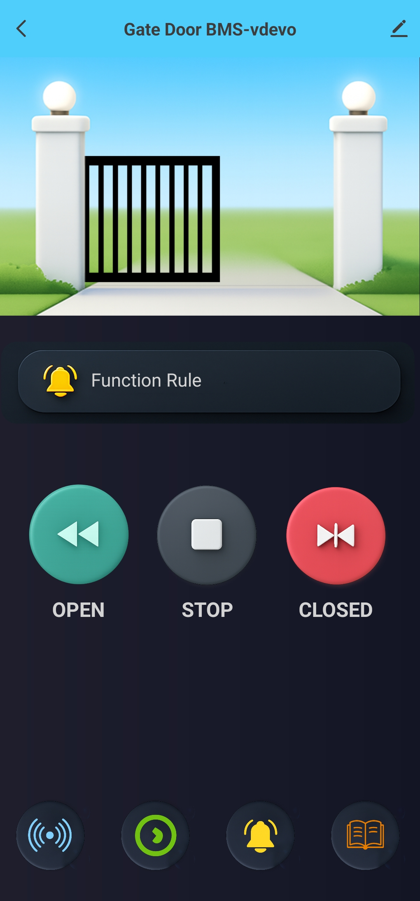
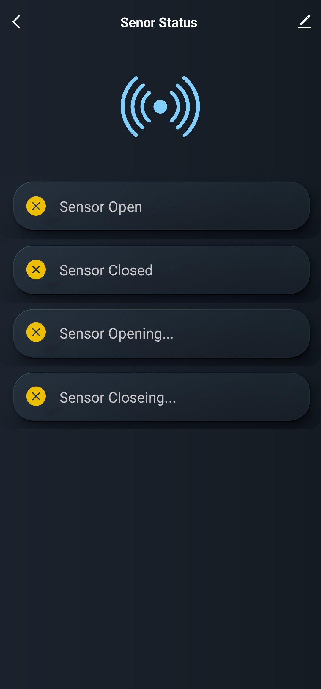
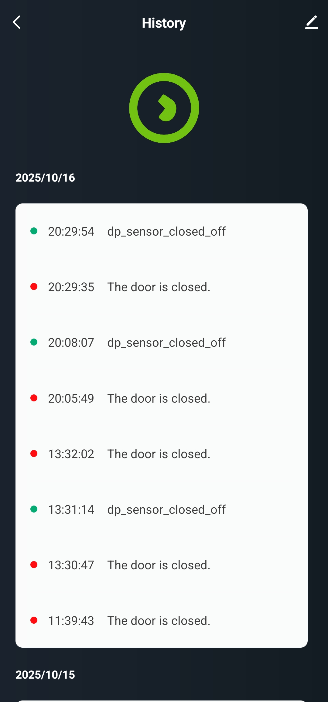
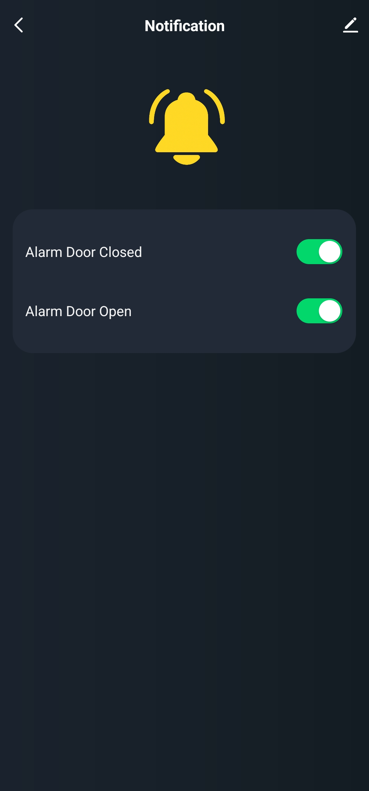

# 🚪 Smart Gate BMS
Smart door control system with beautiful status graphics showing door status and control buttons for opening, closing and stopping via TUYA app and has a support card for Home Assistant

  
  

## 📸 Sample screenshot from TUYA app

Located in the `Screenshot_TUYA` folder:

  
  
  
  

## Home Assistant Card
https://github.com/vanchaiy/gate-control-card

# 🐵 Coming soon...
